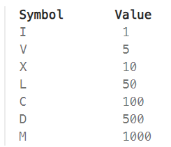

8 August, 2024

## Problem 1: [Left Rotate the Array by One](https://takeuforward.org/data-structure/left-rotate-the-array-by-one/)

Problem Statement: Given an array of N integers, left rotate the array by one place.

Example 1:
Input:
 N = 5, array[] = {1,2,3,4,5}
Output:
 2,3,4,5,1
Explanation:
 
Since all the elements in array will be shifted 
toward left by one so ‘2’ will now become the 
first index and and ‘1’ which was present at 
first index will be shifted at last.

Example 2:
Input:
 N = 1, array[] = {3}
Output:
 3
Explanation:
 Here only element is present and so 
the element at first index will be shifted to 
last index which is also by the way the first index.

## Problem 2: [Roman to Integer](https://leetcode.com/problems/roman-to-integer/)

Roman numerals are represented by seven different symbols: I, V, X, L, C, D and M.

For example, 2 is written as II in Roman numeral, just two ones added together. 12 is written as XII, which is simply X + II. The number 27 is written as XXVII, which is XX + V + II.

Roman numerals are usually written largest to smallest from left to right. However, the numeral for four is not IIII. Instead, the number four is written as IV. Because the one is before the five we subtract it making four. The same principle applies to the number nine, which is written as IX. There are six instances where subtraction is used:

I can be placed before V (5) and X (10) to make 4 and 9. 
X can be placed before L (50) and C (100) to make 40 and 90. 
C can be placed before D (500) and M (1000) to make 400 and 900.
Given a roman numeral, convert it to an integer.

Example 1:
Input: s = "III"
Output: 3
Explanation: III = 3.

Example 2:
Input: s = "LVIII"
Output: 58
Explanation: L = 50, V= 5, III = 3.

Example 3:
Input: s = "MCMXCIV"
Output: 1994
Explanation: M = 1000, CM = 900, XC = 90 and IV = 4.

Constraints:
1 <= s.length <= 15
s contains only the characters ('I', 'V', 'X', 'L', 'C', 'D', 'M').
It is guaranteed that s is a valid roman numeral in the range [1, 3999].

[Time Optimised Solution](https://leetcode.com/problems/roman-to-integer/submissions/1355733553)

[Space Optimised Solution](https://leetcode.com/problems/roman-to-integer/submissions/1355696054)

[Time and Space Optimised](https://leetcode.com/problems/roman-to-integer/submissions/1355738767)